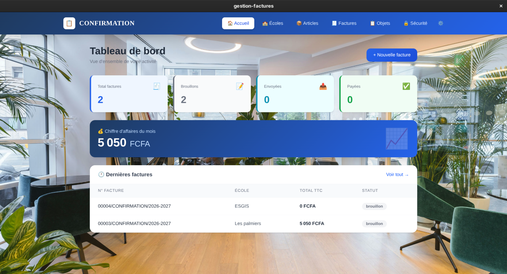
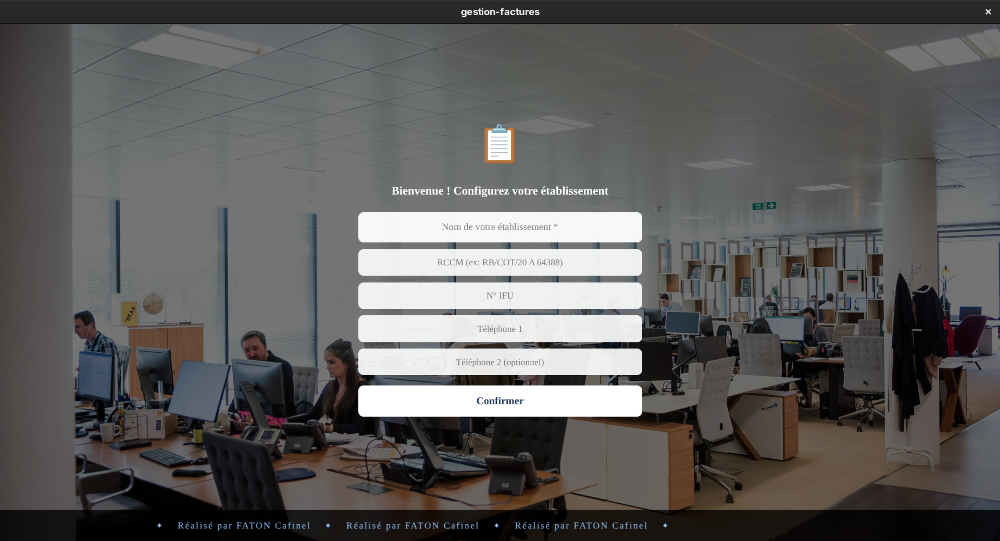
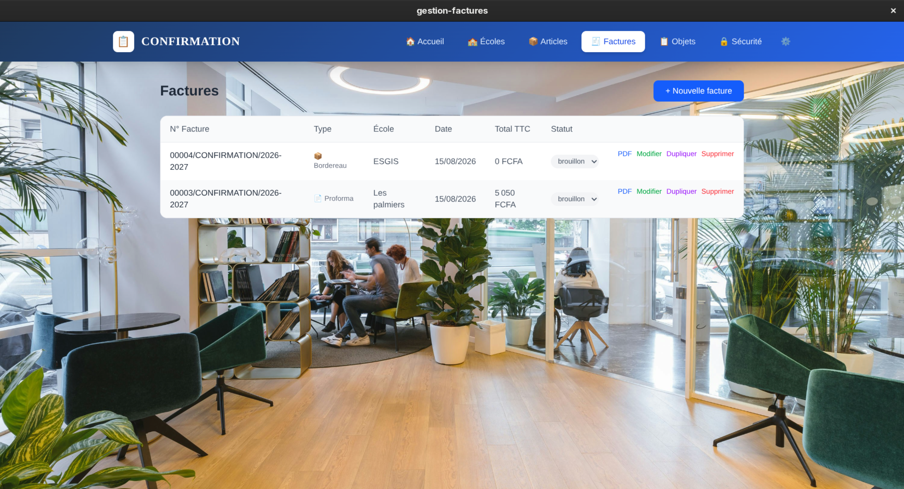
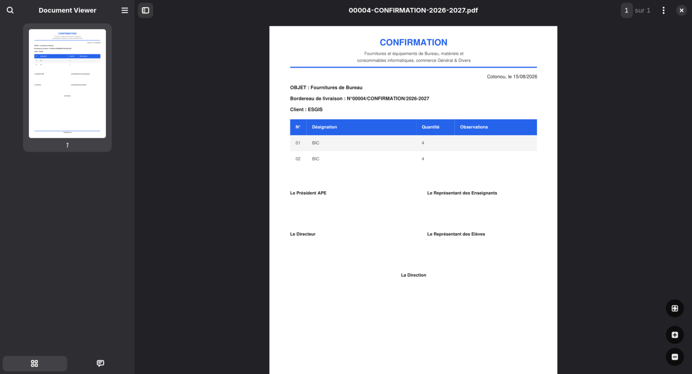

# GestFact

Application de bureau pour la gestion de facturation, pensée pour les prestataires de services (écoles, formateurs, indépendants) ainsi que les vendeurs en boutique. GestFact permet de créer, suivre et exporter ses factures en quelques clics, sans connexion internet requise.

## Aperçu



## Fonctionnalités

- **Gestion des factures** — création, modification et suivi des factures clients
- **Génération PDF** — export professionnel des factures via jsPDF, prêt à imprimer ou envoyer
- **Gestion des clients et articles/objets** — base de données locale pour vos clients, produits et services
- **Module Écoles** — suivi dédié pour les prestataires travaillant avec des établissements scolaires
- **Authentification et sécurité** — système de connexion avec gestion d'activation et récupération de compte
- **Tableau de bord** — vue d'ensemble de l'activité (factures, chiffre d'affaires, etc.)
- **Fonctionnement 100% local** — toutes les données sont stockées en local via SQLite, aucune dépendance à une connexion internet pour l'usage quotidien

## Stack technique

| Domaine | Technologie |
|---|---|
| Interface | React, Vite |
| Application de bureau | Electron |
| Base de données | SQLite (sql.js) |
| Génération PDF | jsPDF, jspdf-autotable |

## Installation et lancement

Prérequis : [Node.js](https://nodejs.org/) (version 18 ou supérieure) installé sur votre machine.

```bash
# Cloner le dépôt
git clone https://github.com/cafinelfaton-jpg/gestfact-app.git
cd gestfact-app

# Installer les dépendances
npm install

# Lancer l'application en mode développement
npm run electron
```

## Utilisation

Au premier lancement, l'application crée automatiquement sa base de données locale. Vous pouvez ensuite :

1. Créer votre compte / vous connecter
2. Ajouter vos clients et vos articles/services
3. Générer vos factures et les exporter en PDF
4. Suivre votre activité depuis le tableau de bord

## Captures d'écran

| Connexion | Gestion des factures | Génération PDF |
|---|---|---|
|  |  |  |

## Auteur

**Faton Cafinel** — Étudiant en Software Architecture & Web Development (ESGIS, Cotonou, Bénin)

[GitHub](https://github.com/cafinelfaton-jpg) · [LinkedIn](https://www.linkedin.com/in/cafinel-faton-985453339/)

## Licence

Projet personnel réalisé à des fins de démonstration et de portfolio.
